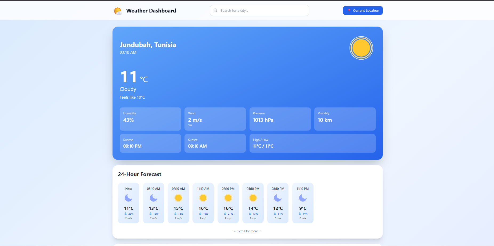

# 🌤️ MERN Weather Dashboard

A production-ready, full-stack Weather Dashboard built with MongoDB, Express, React, Node.js, and TypeScript. Features real-time weather data from **OpenWeather API**, accurate 5-day forecasts with 3-hour intervals, animated Lottie weather icons, offline PWA support, and secure JWT authentication.

    

## ✨ Features

- 🌍 **Geolocation-based weather** - Automatic location detection with browser API
- 🌡️ **Current weather conditions** - Real-time accurate data from OpenWeather API
- 📅 **40-point forecast** - 5-day weather predictions with 3-hour intervals (120 hours)
- 🎨 **Animated weather icons** - Beautiful Lottie animations for all weather conditions
- 🔍 **City search** - Smart search with debounced autocomplete
- 💾 **Offline support** - Progressive Web App with Service Worker caching
- 🔐 **JWT Authentication** - Secure user registration and login system
- ⭐ **Favorite locations** - Save and manage your favorite cities
- 📱 **Fully responsive** - Optimized for mobile, tablet, and desktop
- 🎭 **Beautiful UI** - Modern design with Tailwind CSS and smooth animations
- ♿ **Accessible** - WCAG AA compliant with ARIA labels
- 🚀 **Production-ready** - Rate limiting, security headers, error handling
- 💨 **Fast & efficient** - MongoDB caching with 5-minute TTL

## 📸 Screenshots

### Main Dashboard


*Current weather display with animated icons, detailed metrics (humidity, wind, pressure, visibility), and hourly forecast carousel*


## 🛠️ Tech Stack

**Frontend:**
- React 18 with TypeScript
- Vite (build tool)
- Tailwind CSS
- Axios for API calls
- Lottie React for animations

**Backend:**
- Node.js + Express
- TypeScript
- MongoDB + Mongoose
- JWT authentication
- Bcrypt for password hashing
- Helmet (security)
- Express Rate Limit

**APIs:**
- OpenWeather Current Weather API (free tier)
- OpenWeather 5 Day / 3 Hour Forecast API (free tier)
- OpenWeather Geocoding API for city search

## 🚀 Quick Start

### Prerequisites

- Node.js 20+ installed
- MongoDB (local or Atlas account)
- OpenWeather API key ([Get free key](https://openweathermap.org/api))

### Installation

1. **Clone the repository**
```bash
git clone https://github.com/Mghizlen/weather-app.git
cd weather-app
```

2. **Install backend dependencies**
```bash
cd backend
npm install
```

3. **Install frontend dependencies**
```bash
cd ../frontend
npm install
```

4. **Setup environment variables**

Create `backend/.env` from `.env.example`:
```env
PORT=5000
NODE_ENV=development
MONGODB_URI=mongodb://localhost:27017/weather-dashboard
OPENWEATHER_API_KEY=your_api_key_here
JWT_SECRET=your_random_secret_jwt_key_change_this
JWT_EXPIRES_IN=7d
CACHE_TTL_SECONDS=300
CORS_ORIGIN=http://localhost:5173
```

Create `frontend/.env`:
```env
VITE_API_URL=http://localhost:5000
```

5. **Start development servers**

**Option A: Using the run script (Linux/Mac)**
```bash
chmod +x scripts/run-local.sh
./scripts/run-local.sh
```

**Option B: Manual start (Windows/All platforms)**
```powershell
# Terminal 1 - Backend
cd backend
npm run dev

# Terminal 2 - Frontend
cd frontend
npm run dev
```

6. **Access the application**
- Frontend: http://localhost:5173
- Backend: http://localhost:5000
- API Health: http://localhost:5000/api/health

## 📁 Project Structure

```
weather-app/
├── backend/                # Backend Express API
│   ├── src/
│   │   ├── controllers/    # Route controllers
│   │   ├── models/         # Mongoose models
│   │   ├── routes/         # API routes
│   │   ├── services/       # Business logic
│   │   ├── middleware/     # Custom middleware
│   │   ├── app.ts          # Express app config
│   │   └── server.ts       # Server entry point
│   ├── package.json
│   ├── tsconfig.json
│   └── .env.example
├── frontend/               # Frontend React app
│   ├── src/
│   │   ├── components/     # React components
│   │   ├── pages/          # Page components
│   │   ├── hooks/          # Custom React hooks
│   │   ├── lib/            # Utilities and API client
│   │   ├── types/          # TypeScript types
│   │   ├── assets/         # Static assets
│   │   ├── App.tsx         # Root component
│   │   └── main.tsx        # Entry point
│   ├── public/             # Public assets
│   ├── package.json
│   ├── vite.config.ts
│   └── tailwind.config.js
├── scripts/                # Utility scripts
│   ├── run-local.sh        # Start dev servers
│   └── seed-favorites.ts   # Seed database
├── SETUP.md                # Setup instructions
└── README.md               # This file
```

## 🔌 API Endpoints

### Weather
- `GET /api/health` - Health check
- `GET /api/weather/current?lat=&lon=&units=` - Get current weather and forecast
- `GET /api/weather/search?q=` - Search cities (autocomplete)

### Authentication
- `POST /api/auth/register` - Register new user
- `POST /api/auth/login` - Login user
- `GET /api/auth/me` - Get current user (requires auth)

### Locations
- `POST /api/location/save` - Save favorite location (requires auth)
- `GET /api/location/favorites` - Get user's favorites (requires auth)
- `DELETE /api/location/favorites/:id` - Delete favorite (requires auth)

## 🧪 Testing

**Backend tests:**
```bash
cd backend
npm test
npm run test:watch
```

**Frontend tests:**
```bash
cd frontend
npm test
npm run test:watch
```

## 🚢 Deployment

### Frontend (Vercel)
1. Push code to GitHub
2. Connect repository to Vercel
3. Set build command: `cd frontend && npm run build`
4. Set output directory: `frontend/dist`
5. Add environment variable: `VITE_API_URL=<your-backend-url>`

### Backend (Render/Railway/Heroku)
1. Push code to GitHub
2. Connect repository to hosting platform
3. Set build command: `cd backend && npm run build`
4. Set start command: `cd backend && npm start`
5. Add all environment variables from `.env.example`

### Database (MongoDB Atlas)
1. Create free cluster at [MongoDB Atlas](https://www.mongodb.com/cloud/atlas)
2. Get connection string
3. Add to backend `MONGODB_URI` environment variable

## 🎨 Lottie Animations

The app includes beautiful animated weather icons using Lottie:

**Included animations:**
- ☀️ **Weather-sunny.json** - Clear day with animated sun
- 🌙 **Weather-night.json** - Clear night with moon
- ☁️ **partly cloudy-day-fog.json** - Cloudy/foggy conditions
- 🌧️ **rainy icon.json** - Rain and drizzle
- ❄️ **snow icon.json** - Snow conditions
- ⛈️ **Weather-thunder.json** - Thunderstorms
- 💨 **Weather-windy.json** - Windy weather

All animations are stored in `frontend/src/assets/lottie/` and automatically mapped to weather conditions in `frontend/src/mapIcons.ts`.

## 🔒 Security Features

- JWT token authentication
- Password hashing with bcrypt
- Rate limiting on all routes
- Helmet security headers
- CORS protection
- Input validation and sanitization
- MongoDB injection prevention
- XSS protection

## 📝 License

MIT License - feel free to use this project for learning or production.

## 🤝 Contributing

Contributions are welcome! Please feel free to submit a Pull Request.

## 🐛 Known Issues

- TypeScript errors before `npm install` (expected)
- Lottie animations require manual download
- Service Worker only works in production build

## 📧 Support

For issues, questions, or suggestions, please open an issue on GitHub.

## 🙏 Acknowledgments

- Weather data from [OpenWeather](https://openweathermap.org/)
- Animated icons from [LottieFiles](https://lottiefiles.com/)
- Built with [Vite](https://vitejs.dev/), [React](https://react.dev/), and [Express](https://expressjs.com/)
- UI styled with [Tailwind CSS](https://tailwindcss.com/)

---

Made with ❤️ using MERN Stack by [Mghizlen](https://github.com/Mghizlen)

**Live Demo:** Coming soon! 🚀

**Repository:** [github.com/Mghizlen/weather-app](https://github.com/Mghizlen/weather-app)
